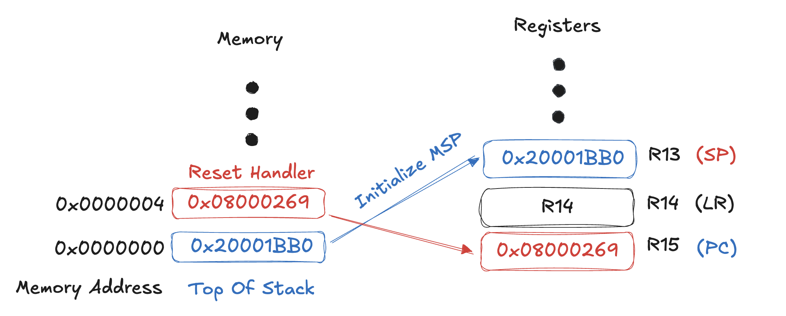
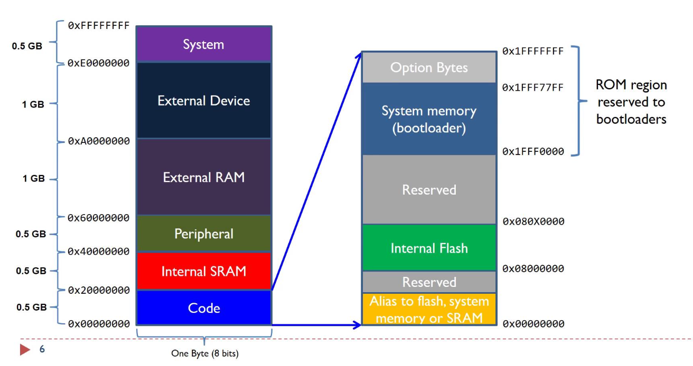
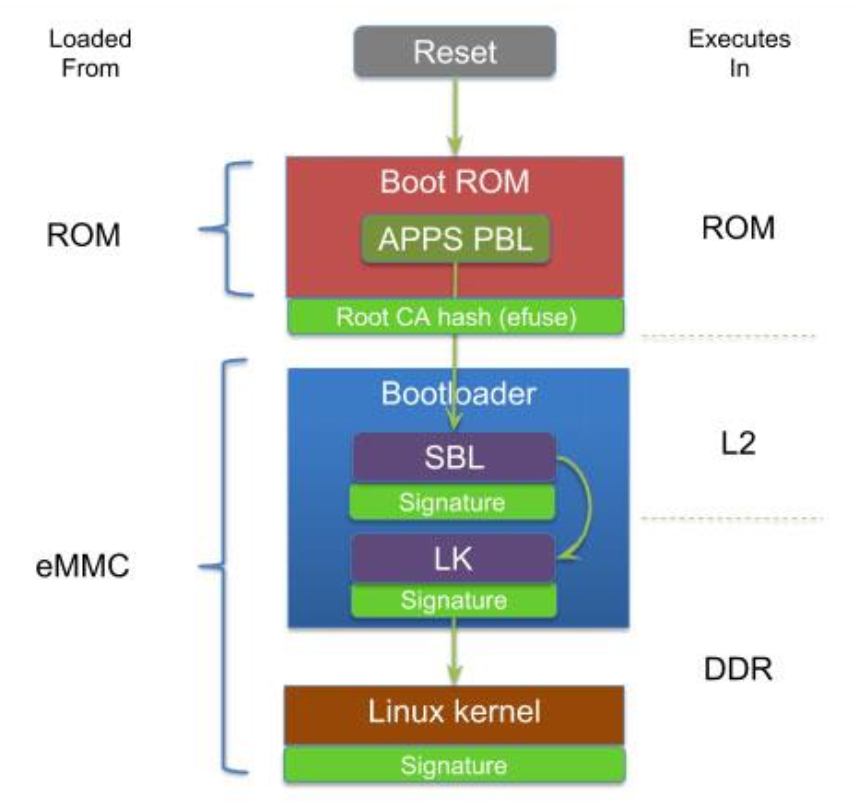

## BOOT

- when reset active low

### Booting Process

1. Determine boot mode
1. Fetch MSP (main stack pointer) from address 0x00000000
1. Fetch PC (program counter) from address 0x00000004



> Top Of Stack: Value to initialize the Main Stack Pointer (MSP)
>
> Value to initialize: the Program Counter (PC)
>
> SP: Stack Pointer
>
> LN: Link Register (ตัวเก็บ return address)
>
> PC: Program Counter (ตัวชี้คำสั่งต่อไป)

เมื่อกดปุ่ม Reset CPU

1. อ่านค่า Stack Pointer จาก 0x00000000 --> ใส่ลงใน SP (MSP)

1. อ่านค่า Reset_Handler จาก 0x00000004 --> ใส่ลงใน PC

1. กระโดดไปรัน Reset_Handler()

1. Reset_Handler ทำงาน initializing ทุกอย่าง แล้วเรียก main()

คือลักษณะดังภาพต่อไปนี้:
• ค่า Stack (0x20001BB0) --> ใส่ใน SP
• ค่า Reset_Handler (0x08000269) --> ใส่ใน PC
• CPU เริ่มรัน Reset_Handler() --> แล้วรัน main()

ตัวอย่างใน Reset_Handler:

```c
void Reset_Handler(void) {
    // Copy data section from flash to SRAM
    // Initialize .bss section to zero
    // Call SystemInit() to set up the system clock
    // Call main()
    main();
}
```

### Boot Modes

- Boot from Flash memory --> Flash
- Boot from System Memory (bootloader can boot from external device) --> ROM Bootloader
- Boot from embedfrf SRAM --> Internal RAM (Static Random-Access Memory)



ใช้หลักการ alias สามารถ link ไปที่อื่นได้ตอนที่ Boot

- ส่วน Code ที่อยู่ในภาพ จะสามารถ map address ที่ Flash, System Memory หรือ SRAM ไป 0X0000000 ได้
- เช่น ถ้า Boot จาก Flash, จะ map address Flash ไปที่ 0X00000000

### Boot Mode Qualcomm Snapdragon



1. Reset
1. Boot ROM
   - **Loaded From** ROM **Execute in** ROM
   - แก้ไม่ได้
   - APPS PBL (config how many ram?, where to boot?)
   - CA hash (check correctness of bootloader)
1. Bootloader
   - **Loaded From** eMMC
   - SBL **Execute in** L2 (cache)
   - LK **Execute in** DDR
   - DDR
     - must calibrate (sync clock and data)
     - parallel
1. Linux Kernel

> ตอนแรก SBL จะไม่มี RAM จะใช้ L2 Cache แทน (Cache ที่ ไม่ enable RAM it just memory) ใช้ l2 ทั้งก้อนเพื่อ calibrate DDR และค่อย enable RAM

### U-Boot

1. BL1 (Boot Loader 1): ขนาดเล็ก ทำหน้าที่โหลด BL2 
1. BL2 (Boot Loader 2): ขนาดใหญ่กว่า BL1 จัดการ RAM เผื่อที่จะโหลด U-Boot
1. U-Boot: เก่งพอที่จะรู้จัก partition,access file,RW file,Read Linux uImage ได้
1. decompress uImage move Linux kernel to RAM

### Linux in ARM

1. **POST (Power-On Self-Test)**
   - กระบวนการตรวจเช็คสุขภาพฮาร์ดแวร์ทันทีที่ไฟเข้าเครื่อง (เช็ค CPU, RAM, GPU) เพื่อให้มั่นใจว่าอุปกรณ์พื้นฐานพร้อมทำงาน ก่อนส่งไม้ต่อให้ BIOS

2. **BIOS (Basic Input/Output System)**
   - ทำหน้าที่ Initialize Hardware, ทำ **RAM Calibration**, และอ่านค่าการตั้งค่าจาก **CMOS** เพื่อเลือกว่าจะบูตจากอุปกรณ์ตัวไหน

3. **MBR (Master Boot Record)**
   - BIOS จะวิ่งไปอ่าน **Sector แรกสุด (512 bytes แรก)** ของฮาร์ดดิสก์ ซึ่งเก็บ **Boot Loader Code** ขนาดเล็กและ **Partition Table** เอาไว้ เพื่อชี้เป้าว่าจะไปเรียก Bootloader ตัวเต็มขึ้นมาทำงาน
   - _(หมายเหตุ: ในระบบสมัยใหม่ เปลี่ยนมาใช้ **UEFI** คู่กับ **GPT** แทน BIOS/MBR)_

4. **GRUB (Grand Unified Bootloader)**
   - **Stage 1:** อยู่ใน MBR ทำหน้าที่แค่ **"ชี้ตำแหน่ง Sector"** ของ Stage ถัดไป (เนื่องจากพื้นที่จำกัด จึงยังอ่าน Partition ไม่รู้เรื่อง)
   - **Stage 2:** เป็นตัวโปรแกรมเต็มที่อ่าน File System ได้ เข้าใจ Partition ทำหน้าที่แสดงเมนูเลือก OS และโหลด Kernel

5. **Initramfs (Initial RAM Filesystem) or RAM Disk Image**
   - คือ **"ไฟล์ระบบชั่วคราว"** ที่ GRUB โหลดไปไว้ใน RAM พร้อมกับ Kernel
   - **หน้าที่:** เตรียม Driver ที่จำเป็นเพื่อให้ Kernel สามารถมองเห็นและ Mount Hard Disk ตัวจริง (**Root Filesystem**) ได้สำเร็จ

## RTOS

Real-Time system: ระบบที่ทำงานได้ถูกต้องตามเวลาที่กำหนด

### Types of Real-Time Systems

- Periodic Task: Time-driven
  - checking sensors every 10 ms

- Aperiodic Task: event-driven
  - car react to wall if found

### Timing Constraints (deadlines)

#### 1. Hard Deadline (ห้ามพลาดเด็ดขาด)

**"ช้า = พังพินาศ"**

- **คืออะไร:** เป็น Deadline ที่มีความสำคัญระดับคอขาดบาดตาย
- **ถ้าทำไม่ทัน (Miss):** ระบบจะถือว่า **ล้มเหลวโดยสมบูรณ์ (System Failure)** และอาจก่อให้เกิดความเสียหายร้ายแรง (หายนะ) ต่อทรัพย์สิน หรือชีวิตมนุษย์
- **ค่าของผลลัพธ์:** หากเลยเวลา ข้อมูลนั้นไม่ใช่แค่ไร้ค่า แต่กลายเป็น **ติดลบ** (เกิดผลเสีย)
- **ตัวอย่าง:**
  - **ถุงลมนิรภัยในรถยนต์:** ต้องพองตัวภายในเสี้ยววินาทีที่ชน ถ้าช้าไปแม้แต่นิดเดียว คนขับอาจเสียชีวิต (ระบบล้มเหลว)
  - **เครื่องควบคุมการเต้นของหัวใจ (Pacemaker):** ต้องกระตุ้นหัวใจตามจังหวะเป๊ะๆ ถ้าช้า หัวใจวาย

#### 2. Firm Deadline (พลาดแล้วทิ้งเลย)

**"ช้า = ไร้ค่า (แต่ไม่พัง)"**

- **คืออะไร:** เป็น Deadline ที่สำคัญ แต่ถ้าพลาดก็ยังพอยอมรับได้ในระดับหนึ่ง (ตราบใดที่ไม่พลาดบ่อยเกินไป)
- **ถ้าทำไม่ทัน (Miss):** ข้อมูลหรือผลลัพธ์ที่มาช้า จะถือว่า **"ไม่มีประโยชน์อีกต่อไป" (Zero Utility)** ระบบจะ **ทิ้ง** ข้อมูลนั้นไปเลย ไม่นำมาประมวลผล แต่ระบบโดยรวมยังทำงานต่อได้
- **ค่าของผลลัพธ์:** หากเลยเวลา ค่าจะเป็น **ศูนย์** ทันที
- **ตัวอย่าง:**
  - **Video Conference / ดู Netflix:** วิดีโอแสดงผล 60 เฟรมต่อวินาที ถ้าเฟรมที่ 50 มาช้าเกินเวลา ระบบจะ **ทิ้งเฟรมนั้นไปเลย** (ภาพอาจกระตุกนิดนึง) แล้วข้ามไปแสดงเฟรมที่ 51 แทน มันไม่มีประโยชน์ที่จะเอาเฟรมเก่ามาแสดงตอนที่ตลาดวายไปแล้ว
  - **ระบบพยากรณ์อากาศรายชั่วโมง:** ถ้าคำนวณผลของ 8 โมงเช้าเสร็จตอน 9 โมงเช้า ผลลัพธ์นั้นก็ไร้ค่าแล้ว (ทิ้งได้เลย) แต่โลกไม่แตก

#### 3. Soft Deadline (ช้าได้ไม่ว่ากัน)

**"ช้า = แย่ลง (แต่ยังใช้ได้)"**

- **คืออะไร:** เป็น Deadline ที่มีความยืดหยุ่นสูง
- **ถ้าทำไม่ทัน (Miss):** ข้อมูลที่มาช้า **"ยังคงมีประโยชน์อยู่"** ระบบยังนำไปใช้ต่อได้ แค่ประสิทธิภาพหรือความพึงพอใจจะลดลงเรื่อยๆ ตามความล่าช้า
- **ค่าของผลลัพธ์:** หากเลยเวลา ค่าจะ **ค่อยๆ ลดลง** (Decreasing Utility) แต่ไม่เป็นศูนย์ทันที
- **ตัวอย่าง:**
  - **กดปุ่มในหน้าเว็บ:** เราคาดหวังให้มันเปลี่ยนหน้าทันที แต่ถ้ามันหมุนติ้วๆ สัก 2-3 วินาที (ช้า) สุดท้ายหน้าเว็บก็ยังขึ้นมาให้เราดูได้ (ข้อมูลยังมีค่า แต่เราหงุดหงิด)
  - **การกดเงิน ATM:** ถ้าเครื่องประมวลผลช้า เราก็แค่ยืนรอ เงินก็ยังออกมาครบ ไม่ได้เสียหายอะไรแค่เสียเวลา

### Scheduling algorithms

Task1: high priority

Task2: medium priority

Task3: low priority

- Preemptive Scheduling: Task high priority สามารถ แทรก low priority ได้
- Non-Preemptive Scheduling: ลือกตาก priority แต่ถ้าเลือกแล้วไม่สามารถแทรกได้

- Dynamic Scheduling: Task สามารถเปลี่ยน priority ได้ เช่น ใกล้ deadlines Task 2 ยังไม่เส็จก็ให้ Task2 เป็น high priority

- Static Scheduling

> os manage resource sharing

### Sharing Resource

> ใช้ queue แล้วให้ os จัดการ ถ้าไม่มี queue ใช้ lock

#### Lock on a resource (in microcontroller)

Task1: high priority

Task2: medium priority

Task3: low priority

- If a high priority task finds a resource is locked, it goes to sleep until the resource is available.
- Task is woken up when resource is freed by lower priority task.
- Sounds reasonable, but leads to problems.

### Priority Inversion

in preemptive priority

A: high priority task

B: medium priority task

C: low priority task

Z: resource

- C locks resource Z
- A preempts C --> A sleep until Z is unlocked
- B prempts C --> C,A lower priority than B

### Solving Priority Inversion

- ถ้า high priority task sleep เพราะรอ resource จาก priority ที่ต่ำกว่าให้ เพิ่ม priority ของที่ต่ำกว่าขึ้นมา
- C จะ เป็น high priority ช่วยคราวเผื่อที่จะรีบทำใให้เสร็จแล้ว A จะได้ทำงานต่อ

**RTOS Tickless (หรือ Tickless Idle)** คือเทคนิคการจัดการพลังงานในระบบปฏิบัติการแบบ Real-Time (RTOS) เพื่อ **"ประหยัดแบตเตอรี่"** ให้ได้มากที่สุดในช่วงที่ระบบว่างงาน (Idle) ครับ

เพื่อให้เข้าใจง่าย ผมขอเปรียบเทียบระหว่าง **แบบปกติ (Ticked)** กับ **แบบ Tickless** นะครับ

### Tickless

#### 1. แบบปกติ (Standard Ticked Mode)

ปกติแล้ว RTOS จะทำงานโดยอาศัยจังหวะหัวใจที่เรียกว่า **"System Tick"** (เช่น ทุกๆ 1 มิลลิวินาที)

- **การทำงาน:** ทุกๆ 1 ms จะมีนาฬิกาปลุก (Timer Interrupt) ดังขึ้น เพื่อปลุก CPU ให้ตื่นมาเช็คว่า "มีงานต้องทำไหม?" หรือ "ถึงเวลาสลับงานหรือยัง?"
- **ปัญหา:** แม้ว่าระบบจะไม่มีงานทำเลย (Idle) CPU ก็ยังต้องสะดุ้งตื่นขึ้นมาทุกๆ 1 ms เพื่อรับทราบว่า "อ้อ ไม่มีงานเหรอ งั้นนอนต่อ" แล้วอีก 1 ms ก็ตื่นมาใหม่ วนไปเรื่อยๆ
- **ผลเสีย:** การตื่นๆ หลับๆ ถี่ๆ แบบนี้ **เปลืองไฟมาก** ครับ เพราะ CPU ไม่ได้เข้าสู่โหมดหลับลึก (Deep Sleep) จริงๆ จังๆ สักที

> **เปรียบเทียบ:** เหมือนคุณตั้งนาฬิกาปลุกไว้ทุกๆ 5 นาที เพื่อตื่นมาดูว่า "เช้าหรือยัง?" ทั้งคืน คุณจะเพลียมากและไม่ได้พักผ่อนจริงๆ

#### 2. แบบ Tickless (Tickless Idle Mode)

เทคนิคนี้ออกแบบมาเพื่อแก้ปัญหาข้างบนครับ โดยหลักการคือ **"ถ้าไม่มีงาน ก็ไม่ต้องปลุกพร่ำเพรื่อ"**

- **การทำงาน:**
  1.  เมื่อระบบเข้าสู่ช่วงว่างงาน (Idle Task) ตัว Scheduler จะคำนวณล่วงหน้าว่า "งานชิ้นถัดไปต้องทำตอนไหน?" (สมมติอีก 100 ms ข้างหน้า)
  2.  ระบบจะ **"ปิด"** นาฬิกาปลุกแบบถี่ๆ (System Tick) ทิ้งไป
  3.  แล้วตั้งนาฬิกาปลุกตัวใหม่ (Low Power Timer) ให้ปลุกในอีก **100 ms ข้างหน้าทีเดียวเลย**
  4.  ระหว่าง 100 ms นั้น CPU สามารถเข้าสู่โหมด **Deep Sleep** ได้ยาวๆ โดยไม่มีใครมากวน
- **ข้อดี:** CPU ได้หลับยาว ไฟเลี้ยงถูกตัดจากวงจรที่ไม่จำเป็น ประหยัดแบตเตอรี่ได้มหาศาล (เหมาะมากสำหรับอุปกรณ์ IoT ที่ใช้ถ่าน)

> **เปรียบเทียบ:** คุณดูนาฬิกาเห็นว่าตอนนี้ 22:00 น. และต้องตื่น 06:00 น. คุณเลยตั้งปลุกทีเดียวตอน 06:00 น. แล้วนอนยาวรวดเดียวจนเช้า

### สรุปความแตกต่าง

| คุณสมบัติ                  | Standard RTOS (Ticked)             | Tickless RTOS                                        |
| :------------------------- | :--------------------------------- | :--------------------------------------------------- |
| **พฤติกรรมตอนว่าง (Idle)** | ตื่นมาเช็คทุกๆ Tick (เช่น ทุก 1ms) | ปิด Tick แล้วหลับยาวจนกว่าจะมีงาน                    |
| **การใช้พลังงาน**          | สูง (CPU ตื่นบ่อย overhead เยอะ)   | **ต่ำมาก** (CPU อยู่ใน Sleep Mode ได้นาน)            |
| **ความแม่นยำ**             | แม่นยำตามรอบ Tick                  | ต้องมี Hardware Timer ที่แม่นยำมาช่วยนับตอนหลับ      |
| **ความซับซ้อน**            | ง่าย                               | ซับซ้อนกว่า (ต้องคำนวณเวลาตื่น + ชดเชยเวลาที่หลับไป) |
